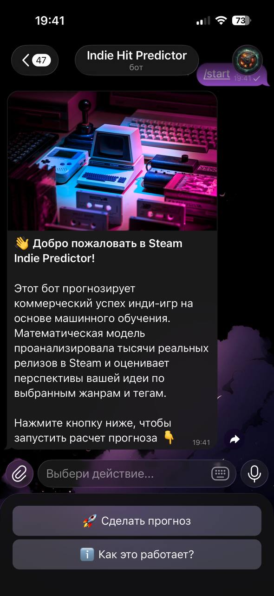
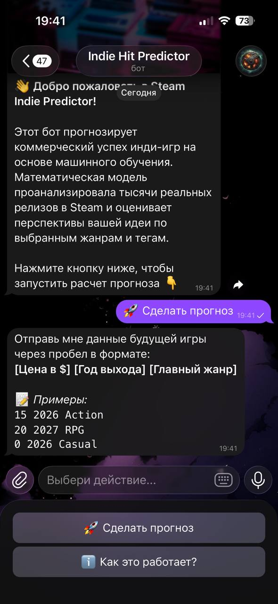
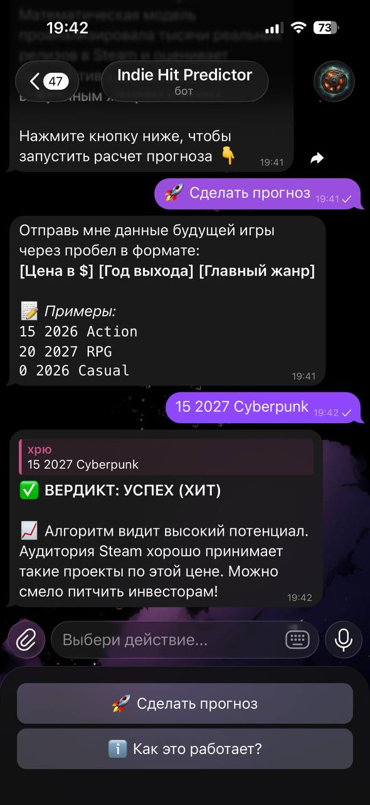

# Steam Indie Hit Predictor 🎮🤖

End-to-End Machine Learning проект для предсказания коммерческого успеха инди-игр в Steam. 

Проект собирает исторические данные, обучает модель классификации и предоставляет удобный интерфейс в виде Telegram-бота для тестирования гипотез (жанр, цена, год релиза). Отличный инструмент для проверки концепта игры перед началом разработки.

## 🛠 Технологический стек
* **Сбор данных:** Python, `requests`, SteamSpy API
* **Анализ и подготовка (EDA):** `pandas`, Jupyter Notebook
* **Machine Learning:** `scikit-learn` (RandomForestClassifier)
* **Деплой:** `aiogram` (асинхронный Telegram-бот), `joblib`

### Интерфейс Telegram-бота

<p align="center">
  
  
  
</p>

## Демонстрация
🔗 [Запустить бота в Telegram](https://t.me/ТВОЙ_ЮЗЕРНЕЙМ_БОТА)

## 📂 Структура проекта
* `/data` — сырые (`raw`) и очищенные (`processed`) датасеты, а также сохраненные веса модели (`models`).
* `/notebooks` — Jupyter-ноутбук с разведочным анализом данных (EDA) и One-Hot Encoding.
* `/src` — исходный код:
  * `parser.py` — скрипт для сбора данных через API.
  * `train.py` — скрипт обучения Случайного леса и сохранения модели.
  * `bot.py` — исходный код Telegram-бота.

## 🚀 Как запустить локально

1. Склонируйте репозиторий:
   ```bash
   git clone https://github.com/dskoloskov/steam_indie_predictor.git
